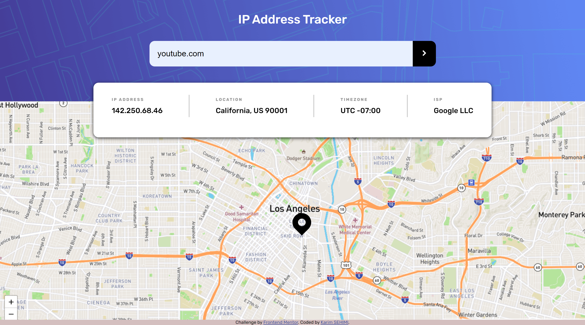

# IP Address Tracker

A web application that geolocates any IP address or domain and displays the result on an interactive map.



## Features

- Automatically detects and displays the user's IP on load
- Search by IP address or domain name
- Displays IP, location, timezone, and ISP
- Interactive map powered by Leaflet.js with OpenStreetMap tiles
- Responsive design (mobile + desktop)
- Loading spinner and error handling

## Tech Stack

- HTML5, CSS3, Vanilla JavaScript (ES6+)
- [Vite](https://vitejs.dev/) for development and build
- [Leaflet.js](https://leafletjs.com/) for interactive maps
- [OpenStreetMap](https://www.openstreetmap.org/) tile layer
- [ipify API](https://www.ipify.org/) for user IP detection
- [IP Geolocation API](https://ipgeolocation.io/) for geolocation data

## Run Locally

1. Clone the repository:
   ```bash
   git clone https://github.com/karimseh/ip_address_tracker.git
   cd ip_address_tracker
   ```
2. Install dependencies:
   ```bash
   npm install
   ```
3. Create a `.env` file from the example:
   ```bash
   cp .env.example .env
   ```
4. Add your [IP Geolocation API key](https://ipgeolocation.io/) to `.env`:
   ```
   VITE_IPGEO_API_KEY=your_api_key_here
   ```
5. Start the dev server:
   ```bash
   npm run dev
   ```
6. To build for production:
   ```bash
   npm run build
   ```

## Live Demo

[ip-address-tracker-git-main.karimseh.vercel.app](https://ip-address-tracker-git-main.karimseh.vercel.app/)

## Credits

- Challenge by [Frontend Mentor](https://www.frontendmentor.io/challenges/ip-address-tracker-I8-0yYAH0)
- Coded by [Karim SEHIMI](https://github.com/karimseh)
